  

  
  
  

  

---

## 👨‍💻 About Me

I'm **Mayank**, a Computer Science Engineering student specializing in **Artificial Intelligence & Machine Learning**. I enjoy building practical software solutions, competing in hackathons, and exploring the intersection of **technology and finance**.

- 🎓 **CSE | AIML Student** — Focused on AI/ML, backend systems, and real-world problem solving
- 🤖 **AI/ML Enthusiast** — Building with Python, NumPy, Pandas, TensorFlow, and TinyML
- ⚙️ **Backend Developer** — FastAPI, Flask, Spring Boot, REST APIs, microservices
- 🏆 **Hackathon Participant** — Love rapid prototyping and collaborative building
- 💡 **Continuous Learner** — Always exploring new frameworks, tools, and architectures

---

## 🔨 Currently Building

| Project | Description | Tech Stack | Status |
|---------|-------------|------------|--------|
| **[Dynamic Patrol Route Optimizer](https://github.com/May-Jo/Dynamic-Patrol-Route-Optimizer)** | Real-time adaptive patrol route optimization using graph algorithms, Dijkstra's algorithm, and spatial indexing | `C` `Graph Algorithms` `Spatial Indexing` |  |
| **[Parking IoT / TinyML](https://github.com/May-Jo/Parking_Iot)** | Smart parking system with IoT sensors and TinyML for edge inference | `HTML` `JavaScript` `TinyML` `IoT` |  |
| **[Seedhemaut Web](https://github.com/May-Jo/seedhemaut_web)** | School digitalization SaaS platform | `TypeScript` `React` `Full Stack` |  |
| **[Awesome Hackathon](https://github.com/May-Jo/awesome-hackathon)** | Curated list of platforms, tools, and guides for hackathon organizers | `Markdown` `Curation` |  |

---

## ⚡ Tech Stack

### 🗣️ Languages

  

### 🤖 AI / ML / Data

  

### ⚙️ Backend

  

### 🌐 Frontend

  

### 🛠️ Tools & DevOps

  

---

## 📊 GitHub Analytics

  
  

  

---

## 🏆 GitHub Trophies

  

---

## 🐍 Contribution Snake

  

---

## 🎬 Developer Vibes

  
  

---

## 🌟 Featured Projects

### 🏆 **Dynamic Patrol Route Optimizer**
> Dynamic, event-aware and real-time adaptive patrol route optimization system using graph algorithms, Dijkstra's algorithm, spatial indexing and selective route re-optimization.
- **Tech:** `C` `Graph Algorithms` `Dijkstra` `Spatial Indexing`
- 🔗 [github.com/May-Jo/Dynamic-Patrol-Route-Optimizer](https://github.com/May-Jo/Dynamic-Patrol-Route-Optimizer)

### 🚗 **Parking IoT / TinyML**
> Smart parking system with IoT sensors and TinyML for edge inference.
- **Tech:** `HTML` `JavaScript` `TinyML` `IoT` `Edge Computing`
- 🔗 [github.com/May-Jo/Parking_Iot](https://github.com/May-Jo/Parking_Iot)

### 🏫 **Seedhemaut Web**
> School digitalization SaaS platform for streamlined academic management.
- **Tech:** `TypeScript` `React` `Full Stack` `Web Development`
- 🔗 [github.com/May-Jo/seedhemaut_web](https://github.com/May-Jo/seedhemaut_web)

### 🏆 **Awesome Hackathon**
> Curated platforms, tools, and guides for critical organizers.
- **Tech:** `Curation` `Markdown` `Open Source`
- 🔗 [github.com/May-Jo/awesome-hackathon](https://github.com/May-Jo/awesome-hackathon)

### 📚 **LLM Engineering Coursework**
> Repository accompanying my mastering LLM engineering course.
- **Tech:** `Python` `Jupyter` `LLM` `Transformers` `RAG`
- 🔗 [github.com/May-Jo/llm_engineering](https://github.com/May-Jo/llm_engineering)

### 🎮 **Flappy Bird (Pygame)**
> Classic Flappy Bird clone built with Python and Pygame.
- **Tech:** `Python` `Pygame` `Game Development`
- 🔗 [github.com/May-Jo/flappy-bird-pygame](https://github.com/May-Jo/flappy-bird-pygame)

---

## 🤝 Let's Connect

  
  
  

---

  

  Built with ❤️ by <a href="https://github.com/May-Jo">Mayank</a> • Last updated: 

