

  <a href="https://github.com/May-Jo" target="_blank">
    
  </a>

  &nbsp;&nbsp;
  

<!-- Coding Profiles -->

  

  <a href="https://leetcode.com/u/May-Jo/" target="_blank">
    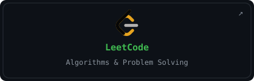
  </a>&nbsp;&nbsp;
  <a href="https://github.com/May-Jo" target="_blank">
    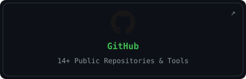
  </a>

<!-- Experience Timeline -->

  

  <a href="https://github.com/May-Jo/Dynamic-Patrol-Route-Optimizer" target="_blank">
    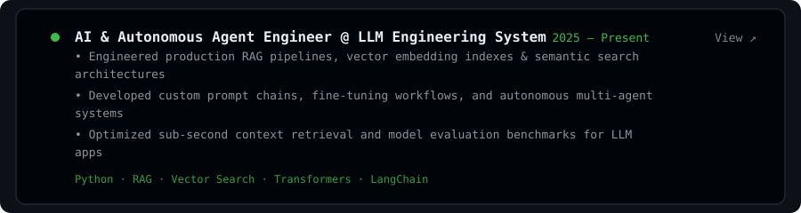
  </a>

  <a href="https://github.com/May-Jo/Parking_Iot" target="_blank">
    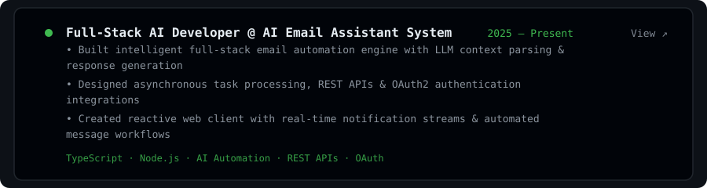
  </a>

  <a href="https://github.com/May-Jo/awesome-hackathon" target="_blank">
    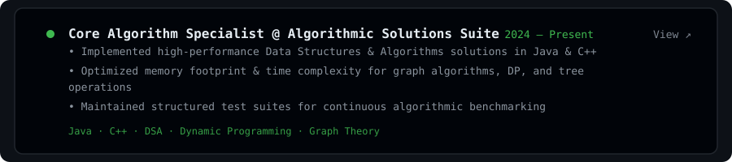
  </a>

<!-- Tech Stack -->

  <a href="https://github.com/May-Jo" target="_blank">
    
  </a>

<!-- Contribution Graph / Git Stats -->

  <a href="https://github.com/May-Jo" target="_blank">
    
  </a>

<!-- Featured Projects -->

  

  <a href="https://github.com/May-Jo/Dynamic-Patrol-Route-Optimizer" target="_blank">
    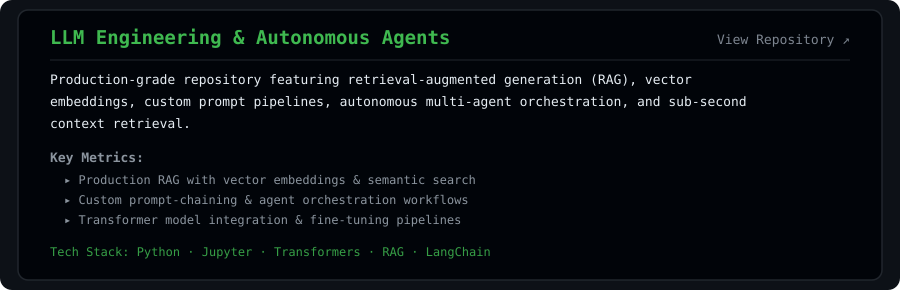
  </a>

  <a href="https://github.com/May-Jo/Parking_Iot" target="_blank">
    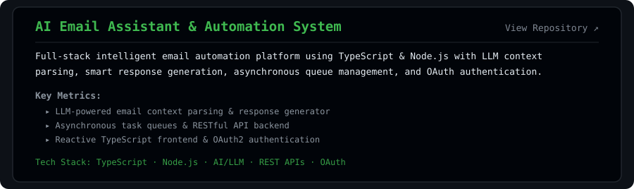
  </a>

  <a href="https://github.com/May-Jo/awesome-hackathon" target="_blank">
    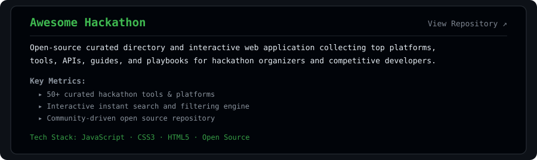
  </a>

  <a href="https://github.com/May-Jo/llm_engineering" target="_blank">
    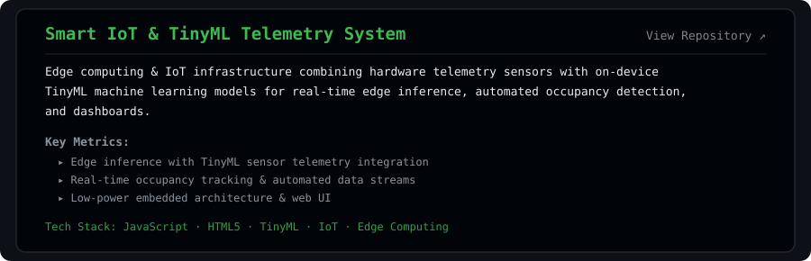
  </a>

<!-- Achievements -->

  

  <a href="https://github.com/May-Jo" target="_blank">
    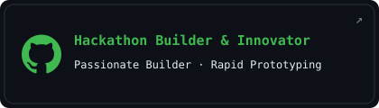
  </a>&nbsp;&nbsp;
  <a href="https://github.com/May-Jo/awesome-hackathon" target="_blank">
    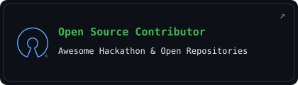
  </a>

<!-- Current Focus -->

  <a href="https://github.com/May-Jo" target="_blank">
    
  </a>

<!-- Badges -->

  
  
  
  
  

  
  
  

  

  <a href="https://github.com/May-Jo" target="_blank">
    
  </a>

